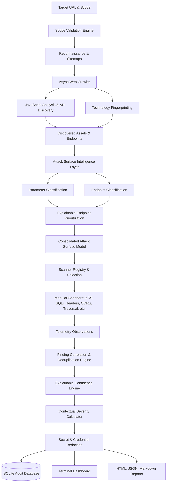

# VulnForge — Web Security Assessment Engine

```text
__      __    _         ______                   
\ \    / /   | |       |  ____|                  
 \ \  / /   _| |_ __   | |__ ___  _ __ __ _  ___ 
  \ \/ / | | | | '_ \  |  __/ _ \| '__/ _` |/ _ \
   \  /| |_| | | | | | | | | (_) | | | (_| |  __/
    \/  \__,_|_|_| |_| |_|  \___/|_|  \__, |\___|
                                       __/ |     
                                      |___/      
```

**VulnForge** (`v0.1.0`) is a modular, high-performance web application security assessment CLI designed for authorized bug-bounty hunters, security engineers, penetration testers, CTF platforms, and security research environments.

> **Authorized-Use Notice**: VulnForge is engineered strictly for authorized security assessments with prior written permission. It does not perform unrestricted exploitation, credential attacks, account takeover, data deletion, malware uploads, or unauthorized cloud metadata probing.

---

## Overview

VulnForge transforms raw web security discovery into professional, explainable findings. Built on **Python 3.12+**, **Typer**, **Rich**, **HTTPX**, and **Pydantic**, it provides a resilient reconnaissance crawler, a modular plugin scanner framework, a signal-based confidence scoring engine, contextual severity calculations, secret redaction, and multi-format reporting (HTML, JSON, Markdown).

---

## Architecture



---

## Complete Feature Matrix

* **Scope Enforcement**: Boundary validation across root domains, wildcard subdomains (`*.example.com`), excluded hosts, and excluded paths across all request and redirect hops.
* **Resilient HTTP Engine**: Centralized async HTTPX wrapper with connection pooling, rate limiting, bounded concurrency, proxy support, and comprehensive exception handling (DNS, TLS, timeouts, 4xx/5xx, redirect loops).
* **Asynchronous Web Crawler**: Scope-enforced breadth-first crawler with configurable recursion depth, HTML link extraction, form parsing, and duplicate suppression.
* **JavaScript Static Discovery**: Non-executing regex/AST static analysis of client-side `.js` assets extracting hidden endpoints, routes, query parameters, and fetch calls.
* **Technology Fingerprinting**: Passive framework & server identification analyzing headers, session cookies, DOM tags, meta generators, and script names.
* **Attack Surface Intelligence**:
  * **Parameter Classification**: Categorizes input parameters (`IDENTIFIER`, `SEARCH`, `URL_INPUT`, `FILE_PATH`, `FILE_NAME`, `REDIRECT`, `AUTHENTICATION`, `SESSION`, `STATE_CHANGE`, `JSON_FIELD`, `NUMERIC`, `BOOLEAN`, `PAGINATION`, `UNKNOWN`) using name semantics, locations, and value shapes.
  * **Endpoint Classification**: Identifies route characteristics (`API`, `AUTHENTICATION`, `ADMIN_LIKE_PATH`, `SEARCH`, `FILE_UPLOAD_CANDIDATE`, `REDIRECT_CANDIDATE`, `DYNAMIC_ROUTE`, `STATIC_ASSET`, `IDENTIFIER_ENDPOINT`, `STATE_CHANGING`, `GENERAL_PAGE`).
  * **Explainable Endpoint Prioritization**: Computes transparent 0–100 priority scores and tiers (`CRITICAL`, `HIGH`, `MEDIUM`, `LOW`) backed by human-readable reasons (deprioritizing static assets while elevating auth boundaries, upload forms, and API routes).
  * **Attack Surface Dashboard**: Comprehensive CLI panel summarizing hosts, endpoints, parameters, forms, APIs, scripts, technologies, and high-priority input densities.
* **Modular Scanner Framework**: Pluggable security analysis modules with `BaseScanner`, `ScannerRegistry`, and `AnalysisContext`.
* **Safe Active & Passive Scanners**:
  * `security-headers`: Missing CSP, HSTS, X-Frame-Options, X-Content-Type-Options, etc.
  * `information-disclosure`: Server banners, debug traces, stack leaks, Django debug pages.
  * `cors`: Arbitrary Origin reflection, wildcard with credentials.
  * `open-redirect`: Unvalidated external redirection via safe canary destinations.
  * `xss`: Reflected parameters and unencoded HTML contexts with benign canaries.
  * `sqli`: Database error signatures and SQL syntax anomalies via safe quote probes.
  * `directory-traversal`: Path traversal indicators on file parameters.
  * `csrf`: State-changing forms lacking anti-CSRF tokens.
  * `file-upload`: File upload parameters and unrestricted upload interface audits.
  * `endpoint-inspector`: Metadata, transport scheme, and parameter signatures.
* **Finding Correlation Engine**: Synthesizes multi-source telemetry observations into unified security findings.
* **Explainable Confidence Engine**: Multi-signal confidence calculation with explainable evidence bands (0–39 Insufficient, 40–69 Potential, 70–89 Probable, 90–100 High Confidence).
* **Contextual Severity Engine**: Calculates realistic severity considering impact, exploitability, authentication requirement, confidence, endpoint criticality, and data exposure.
* **Finding Deduplication**: Merges duplicate findings matching target, endpoint, parameter, and category while preserving unique evidence.
* **Secret & Credential Redaction**: Automatically scrubs Authorization headers, Bearer tokens, JWTs, API keys, passwords, cookies, and AWS credentials.
* **Multi-Format Reporting Engine**: Standalone self-contained HTML (zero external CDN dependencies), structured JSON, and GitHub-compatible Markdown reports.
* **Vulnerability Diffing**: Purely technical comparison between two scan sessions (`vulnforge diff`) tracking NEW, RESOLVED, and UNCHANGED findings.
* **Graceful Interrupt**: Safe Ctrl+C handling that finalizes running operations, persists statistics and findings, closes database connections, and exits cleanly.
* **Configuration Profiles & TOML**: Built-in profiles (`passive`, `safe`, `balanced`, `custom`) and hierarchical config resolution (CLI > Project config > User config > Defaults).

---

## Directory Structure

```text
vulnforge/
├── pyproject.toml                     # Project packaging and metadata
├── README.md                          # Documentation & usage guide
│
├── vulnforge/
│   ├── __init__.py                    # Version & top-level exports
│   ├── main.py                        # Executable entrypoint
│   │
│   ├── cli/                           # Presentation Layer
│   │   ├── banners.py                 # Terminal UI, dashboards, finding detail, diff table
│   │   ├── commands.py                # Command routines (scan, show, diff, crawl, recon, scanners)
│   │   ├── main.py                    # Typer application CLI definitions
│   │   └── themes.py                  # Rich security theme
│   │
│   ├── core/                          # Core Engine Layer
│   │   ├── config.py                  # TOML configuration & profile manager
│   │   ├── context.py                 # ScanContext & ScanStatistics tracker
│   │   ├── engine.py                  # Centralized HttpEngine & redirect scope validator
│   │   ├── exceptions.py              # Structured error hierarchy
│   │   ├── rate_limiter.py            # Async token-rate & concurrency limiter
│   │   ├── scope.py                   # ScopeEngine (exact, wildcard, exclude rules)
│   │   └── session.py                 # HTTPX AsyncClient factory & connection pools
│   │
│   ├── correlation/                   # Correlation & Confidence Engine
│   │   ├── confidence.py              # Explainable confidence scoring & signal evaluation
│   │   ├── deduplicator.py            # Finding deduplicator & evidence merger
│   │   ├── engine.py                  # CorrelationEngine orchestrator
│   │   └── severity.py                # Contextual severity calculation
│   │
│   ├── crawler/                       # Recon & Discovery Engine
│   │   ├── crawler.py                 # Asynchronous WebCrawler
│   │   ├── forms.py                   # HTML Form parser & field extractor
│   │   ├── links.py                   # Link extraction & filtering
│   │   ├── parser.py                  # HTML response parser
│   │   └── sitemap.py                 # robots.txt and sitemap.xml parsers
│   │
│   ├── discovery/                     # Inventory & Asset Fingerprinting
│   │   ├── endpoints.py               # Endpoint inventory manager
│   │   ├── javascript.py              # Static JS regex endpoint/param analyzer
│   │   ├── parameters.py              # Parameter inventory & classification
│   │   └── technologies.py            # Technology & framework fingerprinter
│   │
│   ├── intelligence/                  # Attack Surface Intelligence
│   │   ├── endpoints.py               # EndpointClassifier (API, Auth, Admin, etc.)
│   │   ├── models.py                  # AttackSurface, Parameter/EndpointClassification
│   │   ├── parameters.py              # ParameterClassifier (IDENTIFIER, REDIRECT, etc.)
│   │   ├── prioritizer.py             # Explainable EndpointPrioritizer
│   │   └── surface.py                 # AttackSurfaceBuilder & scanner recommender
│   │
│   ├── models/                        # Pydantic & Domain Models
│   │   ├── endpoint.py                # Endpoint model
│   │   ├── parameter.py               # Parameter model
│   │   ├── request.py                 # HttpRequest model
│   │   ├── response.py                # HttpResponse model
│   │   └── target.py                  # Target model & scope validator
│   │
│   ├── reporting/                     # Multi-Format Reporting Engine
│   │   ├── html_report.py             # Standalone responsive HTML generator
│   │   ├── json_report.py             # Structured JSON report generator
│   │   └── markdown_report.py         # GitHub-compatible Markdown generator
│   │
│   ├── scanners/                      # Modular Scanner Modules
│   │   ├── base.py                    # BaseScanner interface & ScannerMode
│   │   ├── context.py                 # AnalysisContext
│   │   ├── cors.py                    # CORSScanner
│   │   ├── csrf.py                    # CSRFScanner
│   │   ├── endpoint_inspector.py      # EndpointInspectorScanner
│   │   ├── engine.py                  # ScannerEngine orchestrator
│   │   ├── file_upload.py             # FileUploadScanner
│   │   ├── information_disclosure.py  # InformationDisclosureScanner
│   │   ├── open_redirect.py           # OpenRedirectScanner
│   │   ├── registry.py                # ScannerRegistry plugin manager
│   │   ├── result.py                  # Observation & Finding data models
│   │   ├── security_headers.py        # SecurityHeadersScanner
│   │   ├── sqli.py                    # SQLiScanner
│   │   ├── traversal.py               # DirectoryTraversalScanner
│   │   └── xss.py                     # XSSScanner
│   │
│   ├── storage/                       # Persistence Layer
│   │   └── database.py                # SQLite database manager & scan history
│   │
│   └── utils/                         # Utilities
│       ├── normalization.py           # URL & query parameter canonicalization
│       ├── redaction.py               # Secret and token scrubber
│       └── validators.py              # URL & IP validation helpers
│
└── tests/                             # Complete Test Suite (111 tests)
```

---

## Installation

### Standard Python Installation
```bash
pip install .
```

### Development Mode
```bash
pip install -e ".[dev]"
```

### Isolated CLI with pipx
```bash
pipx install .
```

---

## CLI Commands Reference

```text
Usage: vulnforge [OPTIONS] COMMAND [ARGS]...

Commands:
  scan       Initiate a structured web security assessment session on the target.
  surface    Analyze, classify, prioritize, and summarize the attack surface of the target.
  recon      Run target reconnaissance: inspect robots.txt, sitemaps, headers, and tech.
  crawl      Asynchronously crawl target, map endpoint tree, extract forms, and parse JS.
  scanners   List available security vulnerability scanners and modules.
  history    View past scan sessions recorded in local SQLite database.
  show       Display comprehensive details, findings, evidence, and remediation.
  diff       Compare security findings between two scan sessions (NEW/RESOLVED).
  config     Manage VulnForge settings and configuration file.
  version    Show VulnForge version and licensing information.
```

---

## Configuration Profiles & TOML

### Configuration Hierarchy
Settings are resolved hierarchically with the following precedence:
1. **CLI Flags** (e.g. `--rate 10 --threads 5 --only xss,sqli`)
2. **Project Configuration** (`./vulnforge.toml` or `./.vulnforge.toml`)
3. **User Configuration** (`~/.config/vulnforge/config.toml` or `$VULNFORGE_CONFIG`)
4. **Built-in Profile Presets & Defaults**

### Available Profiles
* `passive`: Non-intrusive metadata inspection only (rate: 10 req/s, depth: 2, headers/info disclosure).
* `safe` (Default): Non-destructive verification testing (rate: 5 req/s, depth: 3, safe canary tests).
* `balanced`: Comprehensive assessment with thorough parameter fuzzing (rate: 15 req/s, depth: 4).
* `custom`: Adopts values directly from configuration files without preset overrides.

### Example `~/.config/vulnforge/config.toml`
```toml
default_profile = "safe"
default_rate = 5.0
default_threads = 5
default_timeout = 10.0
crawl_depth = 3
follow_redirects = true
verify_tls = true
output_directory = "./reports"
```

---

## Usage Examples

### 1. Attack Surface Intelligence & Mapping
```bash
vulnforge surface https://target.example --depth 3 -o ./reports/surface.json
```

### 2. Full Security Scan
```bash
vulnforge scan https://target.example
```

### 3. Scan with Specific Scanners Only
```bash
vulnforge scan https://target.example --only xss,sqli --profile safe
```

### 3. Scan with Excluded Scanners and Custom Output
```bash
vulnforge scan https://target.example --exclude-scanner open-redirect -o ./reports/audit.html
```

### 4. Inspect Past Scan Session
```bash
vulnforge show 532e8d98-1e42-4f32-8432-15f1f1a54728
```

### 5. Compare Two Scan Sessions (Vulnerability Diff)
```bash
vulnforge diff scan_baseline_id scan_current_id
```

### 6. List Registered Security Scanners
```bash
vulnforge scanners
```

---

## Security Model & Self-Audit

VulnForge implements rigorous defense-in-depth security controls:
1. **Strict Out-of-Scope Blocking**: Every outbound HTTP request and intermediate 3xx redirect is evaluated against scope allowlists/denylists before transmission.
2. **Safe Verification**: Scanners use benign, non-destructive canaries (e.g., alphanumeric tokens, non-executing single quotes, safe domains).
3. **Secret Redaction**: Authorization headers, Bearer tokens, JWTs, API keys, passwords, cookies, and AWS credentials are automatically scrubbed from stored evidence and reports.
4. **Path Traversal Prevention**: Report generation and database paths are sanitized to prevent directory traversal.
5. **SQL Injection Prevention**: Local audit storage uses parameterized SQLite queries exclusively.
6. **XSS Prevention in HTML Reports**: Report generation applies HTML escaping to all target inputs and telemetry snippets.

---

## Future Architecture Roadmap

* [ ] **API Security Testing Engine**: OpenAPI / Swagger parsing, REST endpoint fuzzing.
* [ ] **GraphQL Security Analysis**: Introspection analysis, query depth limit detection, batching attacks.
* [ ] **JWT & Token Analysis**: Alg-none, weak HMAC key cracking, signature tampering.
* [ ] **WebSocket Security Analysis**: Handshake auditing, origin validation, message fuzzing.
* [ ] **Authenticated Scanning**: Session cookie maintainer, OAuth2 token auto-refresh.
* [ ] **Proxy Integration**: Upstream Burp Suite / OWASP ZAP proxy routing.
* [ ] **Headless Browser Integration**: Chrome DevTools Protocol (CDP) DOM execution and DOM-XSS detection.
* [ ] **Security Regression CI/CD**: GitHub Actions workflow integration and SARIF report export.

---

## License

MIT License. See `LICENSE` for details.
