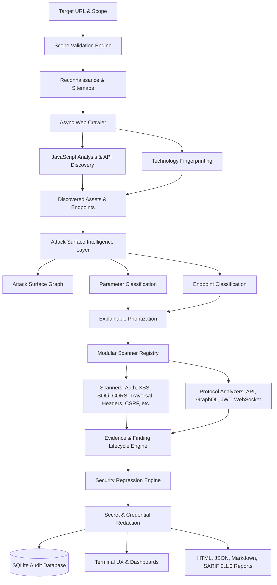

# VulnForge — Professional Web Security Assessment Platform

```text
__      __    _         ______                   
\ \    / /   | |       |  ____|                  
 \ \  / /   _| |_ __   | |__ ___  _ __ __ _  ___ 
  \ \/ / | | | | '_ \  |  __/ _ \| '__/ _` |/ _ \
   \  /| |_| | | | | | | | | (_) | | | (_| |  __/
    \/  \__,_|_|_| |_| |_|  \___/|_|  \__, |\___|
                                       __/ |     
                                      |___/      
```

**VulnForge** (`v0.1.0`) is a production-grade, modular, high-performance web application security assessment CLI and platform designed for authorized bug-bounty hunters, application security engineers, penetration testers, CTF platforms, and CI/CD security regression testing.

> **Authorized-Use Notice**: VulnForge is engineered strictly for authorized security assessments with prior written permission. It does not perform unrestricted exploitation, credential attacks, account takeover, data deletion, malware uploads, or unauthorized cloud metadata probing.

---

## Architecture Overview



---

## Comprehensive Platform Capabilities

### 1. Attack Surface Intelligence & Graph
* **Attack Surface Graph**: Internal directed topological graph (`vulnforge graph`) linking Hosts, Endpoints, Parameters, Forms, JavaScript Assets, Authentication Boundaries, and Security Findings.
* **Endpoint & Parameter Classification**: Semantic identification of input types (`IDENTIFIER`, `SEARCH`, `URL_INPUT`, `FILE_PATH`, `REDIRECT`, `AUTH`, `JSON`) and endpoint roles (`API`, `ADMIN`, `AUTH`, `UPLOAD`, `SEARCH`).
* **Explainable Prioritization**: 0–100 risk scoring prioritizing high-value attack surfaces while deprioritizing static assets.

### 2. Finding Lifecycle & Evidence Engine
* **Formal Finding Lifecycle**: State machine tracking `OBSERVED`, `POTENTIAL`, `PROBABLE`, `CONFIRMED`, `FALSE_POSITIVE`, `RESOLVED`, and `REOPENED`.
* **Structured Evidence**: Rich metadata containing request/response differences, canary reflections, status codes, and deterministic SHA-256 fingerprinting.
* **Automatic Secret Redaction**: Zero plaintext credential leakage across all telemetry, logs, databases, and generated reports.

### 3. API & Protocol Security Assessment
* **OpenAPI & Swagger Security Engine** (`vulnforge api`): Spec auto-detection, route parsing, shadow/undocumented endpoint identification, and dangerous unauthenticated method discovery.
* **GraphQL Security & Introspection Audit** (`vulnforge graphql`): Schema introspection auditing, field suggestion detection, query/mutation cataloging, and sensitive field discovery.
* **JSON Web Token (JWT) Security Analyzer** (`vulnforge token`): Structural validation, `alg: none` detection, missing expiration (`exp`) flags, sensitive claim exposure, and suspicious `kid` inspection.
* **WebSocket Security & CSWSH Audit** (`vulnforge websocket`): Handshake negotiation, Cross-Site WebSocket Hijacking (CSWSH) origin validation, subprotocol auditing, and transport encryption verification (`wss://`).

### 4. Authentication & Multi-Role Authorization
* **Session & Identity Profiles**: Securely test with role profiles (`anonymous`, `user`, `admin`, `custom`).
* **Multi-Role Authorization Engine**: Comparative cross-identity testing discovering BOLA / IDOR, horizontal privilege escalation, vertical privilege escalation, and unauthenticated administrative access.

### 5. Controlled Fuzzing & OAST Verification
* **Controlled Fuzzer** (`vulnforge fuzz`): Rate-limited, bounded-concurrency endpoint and parameter discovery using custom wordlists within strict budget and scope constraints.
* **Out-of-Band (OAST) Verification**: Non-destructive canary generation (`VF-<hex>`) with self-hosted and generic webhook listeners for blind SSRF / XXE / command execution verification.

### 6. CI/CD Integration & SARIF 2.1.0
* **CI/CD Quality Gate** (`vulnforge ci`): Automated build pipeline execution with severity thresholds (`--fail-on high`), confidence filtering, regression blocking, and standardized exit codes (0 = Pass, 1 = Policy Failed, 2 = Error).
* **OASIS SARIF 2.1.0**: Native export for GitHub Code Scanning and enterprise security dashboards.
* **Proxy Interoperability**: Bi-directional HTTP Archive (HAR) import and export for Burp Suite and OWASP ZAP.

---

---

## What Does VulnForge Actually Do?

VulnForge follows an explainable, multi-stage assessment pipeline designed to bridge reconnaissance, attack-surface intelligence, and security testing:

```text
Recon   ──► Learns about the target (headers, technologies, robots.txt, sitemaps, connectivity)
  │
Crawl   ──► Discovers the application's surface (URLs, endpoints, forms, parameters, JS assets)
  │
Surface ──► Organizes and prioritizes what can be tested with deterministic risk scoring
  │
Scan    ──► Executes relevant, supported security checks against prioritized attack surfaces
  │
Finding ──► Explains detected security signals with structured evidence and confidence metrics
  │
Show    ──► Investigates individual scan results, telemetry, and detailed remediation steps
  │
Diff    ──► Compares assessments over time to track newly introduced and resolved issues
```

### Assessment Pipeline Stages
* **`vulnforge recon`**: Passive reconnaissance, HTTP header analysis, technology fingerprinting, and robots/sitemap inspection.
* **`vulnforge crawl`**: Asynchronous recursive crawling, form discovery with normalized inputs, parameter extraction, and JavaScript route analysis.
* **`vulnforge surface`**: Attack surface intelligence modeling, input classification (`IDENTIFIER`, `AUTH`, `FILE_PATH`, etc.), and explainable scanner candidate selection.
* **`vulnforge scan`**: Orchestrates scope validation, reconnaissance, crawling, surface intelligence, dynamic scanner execution, evidence collection, and automated correlation.
* **`vulnforge show`**: Detailed drilldown into scan metadata, discovered inventory, scanner statuses, and itemized findings with evidence.
* **`vulnforge diff`**: Comparative regression analysis between two scans to identify `NEW`, `PERSISTENT`, and `RESOLVED` vulnerabilities.
* **`vulnforge doctor`**: Environmental diagnostics, verifying Python version, dependencies, SQLite database, scanner registry, models, report engine, and storage permissions.

---

## What VulnForge Does NOT Guarantee

> [!IMPORTANT]
> **A scan that completes with zero findings does NOT prove that the target is secure.**

* **Zero Findings vs. Security State**: A clean scan report only indicates that no security signals were detected by the enabled scanners against the discovered attack surface within configured scope and authentication boundaries.
* **Coverage Constraints**: Endpoints requiring unconfigured authentication, complex multi-step workflows, or client-side single-page interactions outside the crawler's depth will remain **untested**. VulnForge clearly displays **Assessment Coverage** and **What Was Not Tested** in its scan summaries.
* **Non-Destructive Boundaries**: VulnForge intentionally avoids destructive payloads, brute-force credential stuffing, and invasive exploits, prioritizing safe and responsible assessment over invasive exploitation.

---

## Complete CLI Commands Reference

```text
Usage: vulnforge [OPTIONS] COMMAND [ARGS]...

Commands:
  scan        Initiate a structured web security assessment session on the target.
  surface     Analyze, classify, prioritize, and summarize the target attack surface.
  graph       Discover, map, and render the Attack Surface Graph topology and hierarchy.
  api         Discover OpenAPI/Swagger specs, map API routes, and detect shadow endpoints.
  graphql     Analyze GraphQL endpoints, audit schema introspection, and find exposed queries.
  token       Analyze a JSON Web Token (JWT) for insecure algorithms, expiration, and claims.
  websocket   Audit WebSocket endpoints for origin validation, CSWSH, and transport encryption.
  fuzz        Execute rate-limited, scoped directory fuzzing with a custom wordlist.
  ci          Run automated CI/CD security quality gate assessment with SARIF export.
  recon       Run target reconnaissance: robots.txt, sitemaps, headers, and technologies.
  crawl       Asynchronously crawl target, map endpoint tree, extract forms, and parse JS.
  regression  Evaluate security regression, reopened flaws, and attack surface changes.
  diff        Compare security findings between two scan sessions (NEW/RESOLVED).
  show        Display comprehensive details, findings, evidence, and remediation.
  history     View past scan sessions recorded in local SQLite database.
  stats       Display scan performance metrics, request statistics, and telemetry.
  scanners    List available security vulnerability scanners and modules.
  doctor      Run environmental diagnostics and subsystem integrity checks.
  config      Manage VulnForge settings and configuration file.
  version     Show VulnForge version and licensing information.
```

---

## Usage Examples

### 1. API Attack Surface & Spec Audit
```bash
vulnforge api https://target.example
```

### 2. GraphQL Introspection & Schema Audit
```bash
vulnforge graphql https://target.example/graphql
```

### 3. Attack Surface Graph Visualization
```bash
vulnforge graph https://target.example
```

### 4. JWT Token Security Analysis
```bash
vulnforge token eyJhbGciOiJub25lIiwidHlwIjoiSldUIn0.eyJzdWIiOiIxMjM0NTY3ODkwIn0.
```

### 5. WebSocket CSWSH & Protocol Audit
```bash
vulnforge websocket wss://target.example/ws
```

### 6. Controlled Directory & Endpoint Fuzzing
```bash
vulnforge fuzz https://target.example --wordlist wordlists/endpoints.txt --max-requests 200
```

### 7. CI/CD Pipeline Assessment with SARIF Export
```bash
vulnforge ci https://target.example --fail-on high --sarif ./reports/results.sarif
```

### 8. Scan Regression & Reopened Flaw Analysis
```bash
vulnforge regression baseline_scan_id candidate_scan_id
```

### 9. Scan Telemetry & Execution Statistics
```bash
vulnforge stats scan_id
```

---

## Configuration Profiles & TOML

Settings are resolved hierarchically:
1. **CLI Flags** (e.g. `--rate 10 --threads 5 --only xss,sqli`)
2. **Project Configuration** (`./vulnforge.toml` or `./.vulnforge.toml`)
3. **User Configuration** (`~/.config/vulnforge/config.toml` or `$VULNFORGE_CONFIG`)
4. **Built-in Profile Presets & Defaults**

### Example `vulnforge.toml`
```toml
[scan]
profile = "safe"

[http]
rate_limit = 5.0
concurrency = 5
timeout = 10.0
verify_tls = true

[crawler]
max_depth = 3

[ci]
fail_on = "high"
min_confidence = 75
fail_on_regression = true
```

---

## Security Model & Safe Testing Philosophy

VulnForge strictly enforces:
1. **Scope Boundaries**: Out-of-scope requests and redirects are rejected at the engine level.
2. **Benign Canaries**: Probing uses non-destructive canaries, syntax reflection indicators, and safe non-executing payloads.
3. **Secret Redaction**: Passwords, tokens, API keys, and session identifiers are sanitized before database persistence or reporting.
4. **Parameterized SQL & Sanitized Paths**: SQLite operations use parameterized queries and report paths are validated against directory traversal.

---

## License

MIT License. See `LICENSE` for details.
